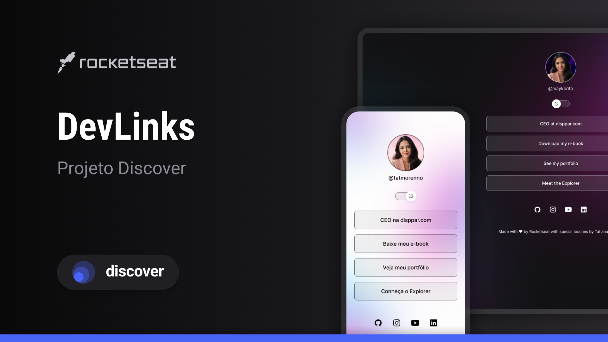

<h1 align="center"> Tat Links </h1>

Programa exclusivo e gratuito, promovido pela Rocketseat para ensino de tecnologias WEB.

  <a href="#-tecnologias">Tecnologias</a>&nbsp;&nbsp;&nbsp;|&nbsp;&nbsp;&nbsp;
  <a href="#-projeto">Projeto</a>&nbsp;&nbsp;&nbsp;|&nbsp;&nbsp;&nbsp;
  <a href="#-layout">Layout</a>&nbsp;&nbsp;&nbsp;|&nbsp;&nbsp;&nbsp;
  <a href="#memo-licença">Licença</a>

  

 

  

## 🚀 Tecnologias

Esse projeto foi desenvolvido com as seguintes tecnologias:

- HTML e CSS
- JavaScript
- Git e Github
- Figma

## 💻 Projeto

Tat Links, como o nome sugere, é um agregador de links para utilizar como cartão de visita online. Criado pela Rocketseat e com microalterações feitas por mim.

## 🔖 Layout

Você pode visualizar o layout do projeto através [DESSE LINK](https://www.figma.com/design/7VKvoJMD9b7XUJX8uvYaXb/DevLinks-%E2%80%A2-Projeto-Discover-(Community)-(Copy)?node-id=10-620&t=UEDMryxkx9puLJoy-1). É necessário ter conta no [Figma](https://figma.com) para acessá-lo.

## :memo: Licença

Esse projeto está sob a licença MIT.

---

Feito com ♥ by Tatiana Moreno :wave: [Conheça a Dísppar!](https://disppar.com/)
